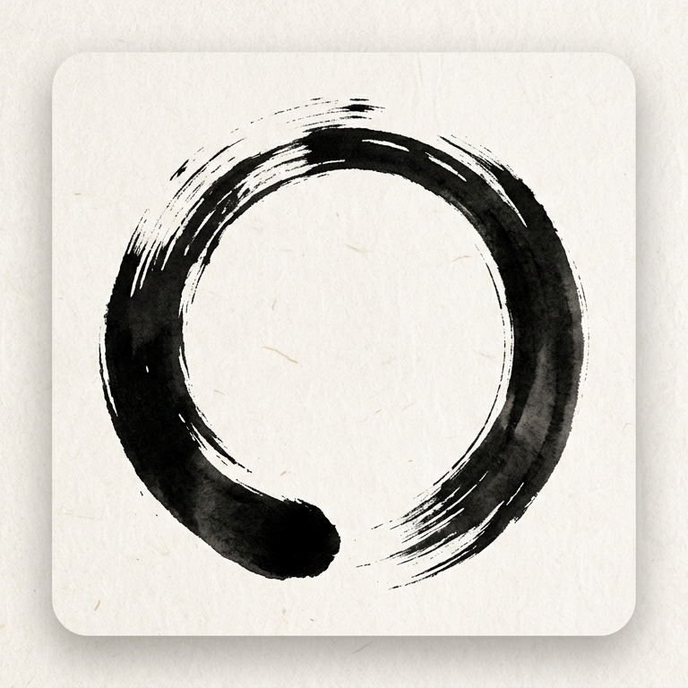

# ZenClip



Defuddle で Web ページの本文だけを抽出し、ワンクリックでクリップボードにコピーする Chrome 拡張。

## 使い方

1. 本文をコピーしたいページを開く
2. ツールバーの ZenClip アイコンをクリック
3. 初回（または必要に応じて）「このデバイス上の他のアプリやサービスにアクセスする」許可が求められたら **許可する** を選ぶ
4. 本文がクリップボードにコピーされ、ページ内にトースト、アイコンに文字数バッジが短時間表示される

クリップボードへの書き込みにはブラウザの許可が必要なため、初回またはサイトごとに許可ダイアログが出ることがあります。許可するとそのページの本文だけがコピーされます。

## 開発

```bash
npm install
npm run dev
```

`npm run dev` で WXT が開発サーバーを起動し、ブラウザに拡張を読み込む。コード変更は HMR で反映される。

本番用ビルド:

```bash
npm run build
```

**Chrome で拡張を読み込むときは、必ず `.output/zen-clip/` を指定する。** `dist/` は使わない（WXT 導入後はマニフェストがそこにはないため「マニフェスト ファイルが見つからない」になる）。

手順: Chrome「拡張機能」→「デベロッパーモード」ON →「パッケージ化されていない拡張機能を読み込む」→ **`.output/zen-clip` フォルダを選択**。

## リリース

`v*` 形式のタグをプッシュすると GitHub Actions がビルドし、GitHub Release に拡張 ZIP を添付する。

```bash
git tag v0.1.0
git push origin v0.1.0
```

[Releases](https://github.com/53able/ZenClip/releases) から ZIP をダウンロードし、解凍したフォルダを Chrome の「パッケージ化されていない拡張機能を読み込む」で指定する。

## アイコンのモチーフ

ツールバーアイコンは **円相（えんそう / Enso）** をモチーフにしている。禅で用いられる「一筆で描いた開いた円」で、雑念を捨て本文だけを取り出すという ZenClip のコンセプト（Zen ＋ Clip）と重ねている。和紙風の地に墨で描いた意匠で、シンプルに「本文だけを写す」イメージを表している。

## 技術

- **WXT**: [wxt-dev/wxt](https://github.com/wxt-dev/wxt) — Web 拡張用フレームワーク（Vite ベース、HMR 対応）
- **Defuddle**: [kepano/defuddle](https://github.com/kepano/defuddle) — Web ページからノイズを除き本文だけを抽出
- **TypeScript 7**（[@typescript/native-preview](https://www.npmjs.com/package/@typescript/native-preview)）で型チェック（tsgo）、WXT でバンドル（Manifest V3）
